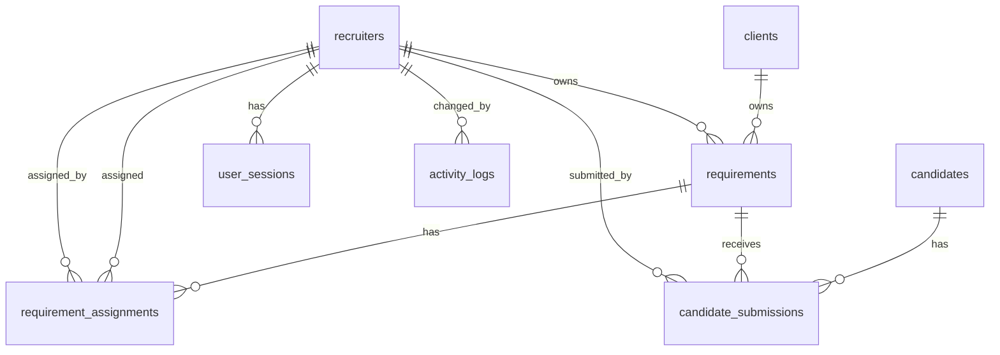

# V1 Database Export — Recruitment Platform

**Status:** Read-only analysis. No schema, data, or code was modified.

| Item | Value |
|------|--------|
| **Schema source** | `backend/database/schema.sql` |
| **Schema label** | V1 (original PostgreSQL DDL) |
| **Created (file header)** | March 2026 |
| **Engine** | PostgreSQL |
| **Extension** | `uuid-ossp` |
| **V1-aligned application code** | `backend/api-server/` (raw SQL against these tables) |

### Important caveat — live app divergence

The **current Express API** (`backend/src/`, Prisma client from `backend/prisma/schema.prisma`) does **not** use this V1 DDL as-is. Notable renames / replacements:

| V1 (`schema.sql`) | Current Prisma app |
|-------------------|--------------------|
| `recruiters` | `users` |
| `candidate_submissions` | `submissions` |
| `user_sessions` | Not used (JWT-only; no session table) |
| `activity_logs` | Replaced by `requirement_activities`, `candidate_status_history`, `communication_logs` |
| Requirement PK = `REQ-YYYY-MM-DD-XXX` | Separate internal `id` + `requirement_id` |

Access patterns in §5 prioritize V1-aligned `api-server` queries. Where the Prisma app differs, that is called out explicitly. No live database was queried for this document (no connection performed); sample rows in §7 come from DDL seed data plus illustrative sanitized examples.

---

## 1. OVERVIEW

### What the application does

This is a **staffing / recruitment platform**. Recruiters manage client job demands (requirements), maintain a candidate pool, submit candidates against open requirements, track interview/selection outcomes, and measure recruiter performance.

### Main features and what they need from the database

| Feature | Purpose | Primary tables |
|---------|---------|----------------|
| **Authentication & sessions** | Login with email/password; store JWT as session; revoke on logout/password change | `recruiters`, `user_sessions` |
| **Client management** | Organizations that own job demands | `clients` |
| **Job requirements (demands)** | Create/list/filter/update/soft-delete openings; track status, priority, SLA, skills | `requirements`, `clients`, `recruiters` |
| **Assignment** | Assign one or more recruiters to a requirement | `requirement_assignments`, `requirements`, `recruiters` |
| **Candidate CRM** | Store candidate profiles, resume refs, CTC, skills | `candidates` |
| **Submissions** | Link a candidate to a requirement; track pipeline status | `candidate_submissions`, `candidates`, `requirements`, `recruiters` |
| **Dashboard / metrics** | Counts by status, priority, recruiter performance, recent activity | `requirements`, `candidate_submissions`, `recruiters` (+ views) |
| **Audit trail** | Auto-log INSERT/UPDATE/DELETE on key tables | `activity_logs` (via triggers) |
| **ID generation** | Human-readable REQ / Cand codes per day | Functions `generate_requirement_id()`, `generate_candidate_code()` |

### End-to-end V1 workflow (conceptual)

1. Recruiter authenticates → row in `user_sessions`.
2. Requirement created → `clients` (find/create) + `requirements` (owner = recruiter).
3. Optionally assign more recruiters → `requirement_assignments`.
4. Candidate created → `candidates` (+ `generate_candidate_code()`).
5. Candidate submitted to requirement → `candidate_submissions`; `requirements.submissions_count` incremented.
6. Submission status moves through Submitted → Interview → Selected / Rejected.
7. Soft-delete requirement sets `is_deleted` / `deleted_at` (row retained).
8. Triggers write change history to `activity_logs` and keep `updated_at` fresh.

---

## 2. FULL SCHEMA

There are **8 tables**, **2 views**, **2 trigger functions** (+ triggers), **2 ID helper functions**.  
There are **no PostgreSQL `CREATE TYPE` enums**; constrained values use `VARCHAR` + `CHECK`.

### 2.1 `clients`

**Purpose:** Client organizations that post / own job requirements.

| Column | Data type | Nullable | Default | Notes |
|--------|-----------|----------|---------|-------|
| `id` | `UUID` | NO | `uuid_generate_v4()` | **PRIMARY KEY** |
| `name` | `VARCHAR(255)` | NO | — | |
| `email` | `VARCHAR(255)` | NO | — | **UNIQUE** |
| `phone` | `VARCHAR(50)` | YES | — | |
| `industry` | `VARCHAR(100)` | YES | — | |
| `company_size` | `VARCHAR(50)` | YES | — | |
| `address` | `TEXT` | YES | — | |
| `created_at` | `TIMESTAMPTZ` | YES | `CURRENT_TIMESTAMP` | |
| `updated_at` | `TIMESTAMPTZ` | YES | `CURRENT_TIMESTAMP` | Maintained by trigger |
| `is_active` | `BOOLEAN` | YES | `true` | |

**Constraints**

- PK: `id`
- UNIQUE: `email`
- CHECK: none
- Indexes beyond PK/UNIQUE: none declared

**Enums / custom types:** none

**Triggers:** `update_clients_updated_at` (BEFORE UPDATE → `update_updated_at_column`)

---

### 2.2 `recruiters`

**Purpose:** Staff users who log in, own requirements, submit candidates, and appear in assignments.

| Column | Data type | Nullable | Default | Notes |
|--------|-----------|----------|---------|-------|
| `id` | `UUID` | NO | `uuid_generate_v4()` | **PRIMARY KEY** |
| `name` | `VARCHAR(255)` | NO | — | |
| `email` | `VARCHAR(255)` | NO | — | **UNIQUE** |
| `password_hash` | `VARCHAR(255)` | NO | — | bcrypt expected in app |
| `title` | `VARCHAR(100)` | YES | `'Recruiter'` | Job title string |
| `role` | `VARCHAR(50)` | YES | `'Recruiter'` | **CHECK** (see below) |
| `phone` | `VARCHAR(50)` | YES | — | |
| `is_active` | `BOOLEAN` | YES | `true` | Login blocked if false (app) |
| `last_login` | `TIMESTAMPTZ` | YES | — | |
| `created_at` | `TIMESTAMPTZ` | YES | `CURRENT_TIMESTAMP` | |
| `updated_at` | `TIMESTAMPTZ` | YES | `CURRENT_TIMESTAMP` | Trigger-maintained |

**Constraints**

- PK: `id`
- UNIQUE: `email`
- CHECK: `role IN ('Recruiter', 'Lead', 'Admin')`

**Indexes:** none beyond PK/UNIQUE

**Triggers:** `update_recruiters_updated_at`; `audit_recruiters_trigger` (AFTER INSERT/UPDATE/DELETE)

---

### 2.3 `requirements`

**Purpose:** Job demands / openings. Soft-deletable. Human-readable string primary key.

| Column | Data type | Nullable | Default | Notes |
|--------|-----------|----------|---------|-------|
| `id` | `VARCHAR(50)` | NO | — | **PRIMARY KEY**; format `REQ-YYYY-MM-DD-XXX` |
| `client_id` | `UUID` | YES | — | **FK → clients(id)** ON DELETE RESTRICT |
| `client_lead_poc` | `VARCHAR(255)` | NO | — | |
| `client_poc` | `VARCHAR(255)` | YES | — | |
| `role_title` | `VARCHAR(255)` | NO | — | |
| `location` | `VARCHAR(255)` | YES | — | |
| `experience` | `VARCHAR(100)` | YES | — | Free-text band |
| `notice_period` | `VARCHAR(100)` | YES | — | |
| `skills` | `TEXT[]` | NO | — | Array, required |
| `technologies` | `TEXT[]` | YES | — | |
| `priority` | `VARCHAR(20)` | YES | `'Medium'` | **CHECK** High/Medium/Low |
| `open_positions` | `INTEGER` | YES | `1` | |
| `sla_days` | `INTEGER` | YES | `30` | |
| `submitting_to` | `VARCHAR(255)` | YES | — | |
| `client_jd_id` | `VARCHAR(100)` | YES | — | |
| `description` | `TEXT` | YES | — | |
| `status` | `VARCHAR(20)` | YES | `'Open'` | **CHECK** (see below) |
| `assignment` | `VARCHAR(20)` | YES | `'Unassigned'` | **CHECK** Unassigned/Assigned |
| `submissions_count` | `INTEGER` | YES | `0` | App increments on submit |
| `owner_id` | `UUID` | YES | — | **FK → recruiters(id)** ON DELETE RESTRICT |
| `assigned_by` | `VARCHAR(255)` | YES | — | Free-text (not FK) |
| `is_deleted` | `BOOLEAN` | YES | `false` | Soft delete |
| `deleted_at` | `TIMESTAMPTZ` | YES | — | |
| `created_at` | `TIMESTAMPTZ` | YES | `CURRENT_TIMESTAMP` | |
| `updated_at` | `TIMESTAMPTZ` | YES | `CURRENT_TIMESTAMP` | Trigger-maintained |
| `updated_by` | `VARCHAR(255)` | YES | — | Free-text actor |

**CHECK constraints**

- `priority IN ('High', 'Medium', 'Low')`
- `status IN ('Open', 'Assigned', 'Submitted', 'Interview', 'Selected', 'Rejected', 'Closed')`
- `assignment IN ('Unassigned', 'Assigned')`

**Foreign keys**

- `client_id` → `clients(id)` ON DELETE RESTRICT
- `owner_id` → `recruiters(id)` ON DELETE RESTRICT

**Indexes**

| Index | Columns |
|-------|---------|
| `idx_requirements_status` | `status` |
| `idx_requirements_assignment` | `assignment` |
| `idx_requirements_client_id` | `client_id` |
| `idx_requirements_owner_id` | `owner_id` |
| `idx_requirements_created_at` | `created_at` |
| `idx_requirements_priority` | `priority` |

**Triggers:** `update_requirements_updated_at`; `audit_requirements_trigger`

**Note:** `client_id` and `owner_id` are nullable in DDL, but list queries in `api-server` use `JOIN` (inner), so rows with NULL FKs would not appear in those list endpoints.

---

### 2.4 `requirement_assignments`

**Purpose:** Junction / assignment history — which recruiters are assigned to which requirements.

| Column | Data type | Nullable | Default | Notes |
|--------|-----------|----------|---------|-------|
| `id` | `UUID` | NO | `uuid_generate_v4()` | **PRIMARY KEY** |
| `requirement_id` | `VARCHAR(50)` | YES | — | **FK → requirements(id)** ON DELETE CASCADE |
| `recruiter_id` | `UUID` | YES | — | **FK → recruiters(id)** ON DELETE CASCADE |
| `assigned_by` | `UUID` | YES | — | **FK → recruiters(id)** ON DELETE SET NULL |
| `assigned_at` | `TIMESTAMPTZ` | YES | `CURRENT_TIMESTAMP` | |
| `is_active` | `BOOLEAN` | YES | `true` | Soft revoke flag |

**Constraints**

- PK: `id`
- UNIQUE: `(requirement_id, recruiter_id)`
- CHECK: none

**Indexes**

| Index | Columns |
|-------|---------|
| `idx_requirement_assignments_requirement_id` | `requirement_id` |
| `idx_requirement_assignments_recruiter_id` | `recruiter_id` |

**Enums / custom types:** none  
**Triggers:** none on this table (no `updated_at`; no audit trigger)

**UNCLEAR:** V1 `api-server` routes inspected do **not** appear to insert into `requirement_assignments`. Assignment may have been intended for later use, or used only via ad-hoc SQL / views. The Prisma app does use a renamed/evolved `requirement_assignments` table heavily.

---

### 2.5 `candidates`

**Purpose:** Candidate master profiles (independent of any single job).

| Column | Data type | Nullable | Default | Notes |
|--------|-----------|----------|---------|-------|
| `id` | `UUID` | NO | `uuid_generate_v4()` | **PRIMARY KEY** |
| `candidate_code` | `VARCHAR(50)` | YES | — | **UNIQUE**; format `Cand-YYYY-MM-DD-XXX` |
| `name` | `VARCHAR(255)` | NO | — | |
| `email` | `VARCHAR(255)` | NO | — | **UNIQUE** |
| `phone` | `VARCHAR(50)` | YES | — | |
| `current_employer` | `VARCHAR(255)` | YES | — | |
| `location` | `VARCHAR(255)` | YES | — | |
| `experience_label` | `VARCHAR(100)` | YES | — | |
| `technologies` | `TEXT[]` | YES | — | GIN-indexed |
| `resume_ref` | `VARCHAR(255)` | YES | — | Storage path/ref |
| `resume_text` | `TEXT` | YES | — | Extracted text |
| `linkedin_url` | `VARCHAR(500)` | YES | — | |
| `highest_qualification` | `VARCHAR(255)` | YES | — | |
| `current_ctc` | `DECIMAL(12,2)` | YES | — | Numeric CTC |
| `expected_ctc` | `DECIMAL(12,2)` | YES | — | |
| `notice_period` | `VARCHAR(100)` | YES | — | |
| `preferred_location` | `VARCHAR(255)` | YES | — | |
| `available_for_interview` | `BOOLEAN` | YES | `true` | |
| `reason_for_job_change` | `TEXT` | YES | — | |
| `offer_in_hand` | `BOOLEAN` | YES | `false` | |
| `created_at` | `TIMESTAMPTZ` | YES | `CURRENT_TIMESTAMP` | |
| `updated_at` | `TIMESTAMPTZ` | YES | `CURRENT_TIMESTAMP` | Trigger-maintained |

**Constraints**

- PK: `id`
- UNIQUE: `candidate_code`, `email`
- CHECK: none

**Indexes**

| Index | Columns / type |
|-------|----------------|
| `idx_candidates_email` | `email` (redundant with UNIQUE but present) |
| `idx_candidates_technologies` | GIN(`technologies`) |
| `idx_candidates_created_at` | `created_at` |

**Triggers:** `update_candidates_updated_at`; `audit_candidates_trigger`

---

### 2.6 `candidate_submissions`

**Purpose:** Application of a candidate to a specific requirement (pipeline record). Also acts as a many-to-many link with rich attributes.

| Column | Data type | Nullable | Default | Notes |
|--------|-----------|----------|---------|-------|
| `id` | `UUID` | NO | `uuid_generate_v4()` | **PRIMARY KEY** |
| `candidate_id` | `UUID` | YES | — | **FK → candidates(id)** ON DELETE RESTRICT |
| `requirement_id` | `VARCHAR(50)` | YES | — | **FK → requirements(id)** ON DELETE RESTRICT |
| `submitted_by` | `UUID` | YES | — | **FK → recruiters(id)** ON DELETE RESTRICT |
| `submitted_on` | `TIMESTAMPTZ` | YES | `CURRENT_TIMESTAMP` | |
| `status` | `VARCHAR(20)` | YES | `'Submitted'` | **CHECK** (see below) |
| `so_number` | `VARCHAR(100)` | YES | — | |
| `total_experience` | `VARCHAR(100)` | YES | — | Snapshot at submit |
| `relevant_experience` | `VARCHAR(100)` | YES | — | |
| `current_ctc` | `VARCHAR(50)` | YES | — | Stored as **string** (unlike candidates) |
| `expected_ctc` | `VARCHAR(50)` | YES | — | String |
| `notice_period` | `VARCHAR(100)` | YES | — | |
| `current_location` | `VARCHAR(255)` | YES | — | |
| `preferred_location` | `VARCHAR(255)` | YES | — | |
| `available_for_interview` | `BOOLEAN` | YES | — | No default |
| `reason_for_job_change` | `TEXT` | YES | — | |
| `offer_in_hand` | `BOOLEAN` | YES | — | No default |
| `linkedin_url` | `VARCHAR(500)` | YES | — | |
| `highest_qualification` | `VARCHAR(255)` | YES | — | |
| `interview_date` | `TIMESTAMPTZ` | YES | — | |
| `interview_feedback` | `TEXT` | YES | — | |
| `selection_date` | `TIMESTAMPTZ` | YES | — | |
| `rejection_reason` | `TEXT` | YES | — | |
| `created_at` | `TIMESTAMPTZ` | YES | `CURRENT_TIMESTAMP` | |
| `updated_at` | `TIMESTAMPTZ` | YES | `CURRENT_TIMESTAMP` | Trigger-maintained |

**CHECK:** `status IN ('Submitted', 'Interview', 'Selected', 'Rejected')`  
**UNIQUE:** `(candidate_id, requirement_id)` — one submission per candidate per requirement

**Indexes**

| Index | Columns |
|-------|---------|
| `idx_submissions_candidate_id` | `candidate_id` |
| `idx_submissions_requirement_id` | `requirement_id` |
| `idx_submissions_submitted_by` | `submitted_by` |
| `idx_submissions_status` | `status` |
| `idx_submissions_submitted_on` | `submitted_on` |

**Triggers:** `update_candidate_submissions_updated_at`; `audit_candidate_submissions_trigger`

---

### 2.7 `user_sessions`

**Purpose:** Persist auth sessions (JWT string stored as `session_token`).

| Column | Data type | Nullable | Default | Notes |
|--------|-----------|----------|---------|-------|
| `id` | `UUID` | NO | `uuid_generate_v4()` | **PRIMARY KEY** |
| `recruiter_id` | `UUID` | YES | — | **FK → recruiters(id)** ON DELETE CASCADE |
| `session_token` | `VARCHAR(255)` | NO | — | **UNIQUE** |
| `expires_at` | `TIMESTAMPTZ` | NO | — | |
| `created_at` | `TIMESTAMPTZ` | YES | `CURRENT_TIMESTAMP` | |
| `last_accessed` | `TIMESTAMPTZ` | YES | `CURRENT_TIMESTAMP` | **UNCLEAR:** app login inserts token but does not update `last_accessed` in inspected auth code |

**Indexes**

| Index | Columns |
|-------|---------|
| `idx_user_sessions_token` | `session_token` |
| `idx_user_sessions_recruiter_id` | `recruiter_id` |
| `idx_user_sessions_expires_at` | `expires_at` |

**Triggers:** none

---

### 2.8 `activity_logs`

**Purpose:** Append-only change history populated by triggers (and optionally by app).

| Column | Data type | Nullable | Default | Notes |
|--------|-----------|----------|---------|-------|
| `id` | `UUID` | NO | `uuid_generate_v4()` | **PRIMARY KEY** |
| `table_name` | `VARCHAR(100)` | NO | — | |
| `record_id` | `VARCHAR(255)` | NO | — | Stringified PK |
| `action` | `VARCHAR(50)` | NO | — | Comment: INSERT/UPDATE/DELETE |
| `old_values` | `JSONB` | YES | — | |
| `new_values` | `JSONB` | YES | — | |
| `changed_by` | `UUID` | YES | — | **FK → recruiters(id)** ON DELETE SET NULL |
| `changed_at` | `TIMESTAMPTZ` | YES | `CURRENT_TIMESTAMP` | |
| `ip_address` | `INET` | YES | — | |
| `user_agent` | `TEXT` | YES | — | |

**Indexes**

| Index | Columns |
|-------|---------|
| `idx_activity_logs_table_record` | `(table_name, record_id)` |
| `idx_activity_logs_changed_at` | `changed_at` |

**Note:** Trigger `audit_trigger_function` always inserts `changed_by = NULL` — so FK actor is never populated by DB triggers. App code would need to set it explicitly for attribution.

**Audited tables (triggers):** `recruiters`, `requirements`, `candidates`, `candidate_submissions`  
**Not audited:** `clients`, `requirement_assignments`, `user_sessions`, `activity_logs` itself

---

### 2.9 Views

#### `active_requirements_view`

Joins `requirements` + `recruiters` (owner) + `clients`.  
Filters: `is_deleted = false` AND `status NOT IN ('Closed', 'Rejected')`.

Columns projected: requirement fields + `owner_name`, `owner_email`, `owner_title`, `client_name`.

#### `recruiter_performance_view`

Per-recruiter aggregates: active requirements, total submissions, interviews, selections, `avg_days_open`.

---

### 2.10 Functions (non-trigger)

| Function | Returns | Purpose |
|----------|---------|---------|
| `generate_requirement_id()` | `TEXT` | Next `REQ-YYYY-MM-DD-NNN` for today |
| `generate_candidate_code()` | `TEXT` | Next `Cand-YYYY-MM-DD-NNN` for today |
| `update_updated_at_column()` | TRIGGER | Sets `NEW.updated_at` |
| `audit_trigger_function()` | TRIGGER | Writes to `activity_logs` |

---

### 2.11 Enums / custom types summary

| Mechanism | Values |
|-----------|--------|
| PostgreSQL ENUM types | **None** |
| CHECK on `recruiters.role` | `Recruiter`, `Lead`, `Admin` |
| CHECK on `requirements.priority` | `High`, `Medium`, `Low` |
| CHECK on `requirements.status` | `Open`, `Assigned`, `Submitted`, `Interview`, `Selected`, `Rejected`, `Closed` |
| CHECK on `requirements.assignment` | `Unassigned`, `Assigned` |
| CHECK on `candidate_submissions.status` | `Submitted`, `Interview`, `Selected`, `Rejected` |

---

## 3. RELATIONSHIPS

### Foreign keys

| From table.column | To table.column | Relationship | ON DELETE | ON UPDATE |
|-------------------|-----------------|--------------|-----------|-----------|
| `requirements.client_id` | `clients.id` | many → one | **RESTRICT** | Not specified → PostgreSQL default **NO ACTION** |
| `requirements.owner_id` | `recruiters.id` | many → one | **RESTRICT** | NO ACTION |
| `requirement_assignments.requirement_id` | `requirements.id` | many → one | **CASCADE** | NO ACTION |
| `requirement_assignments.recruiter_id` | `recruiters.id` | many → one | **CASCADE** | NO ACTION |
| `requirement_assignments.assigned_by` | `recruiters.id` | many → one (optional) | **SET NULL** | NO ACTION |
| `candidate_submissions.candidate_id` | `candidates.id` | many → one | **RESTRICT** | NO ACTION |
| `candidate_submissions.requirement_id` | `requirements.id` | many → one | **RESTRICT** | NO ACTION |
| `candidate_submissions.submitted_by` | `recruiters.id` | many → one | **RESTRICT** | NO ACTION |
| `user_sessions.recruiter_id` | `recruiters.id` | many → one | **CASCADE** | NO ACTION |
| `activity_logs.changed_by` | `recruiters.id` | many → one (optional) | **SET NULL** | NO ACTION |

### Relationship types

| Pair | Type | Via |
|------|------|-----|
| Client → Requirements | **One-to-many** | `requirements.client_id` |
| Recruiter → Requirements (owner) | **One-to-many** | `requirements.owner_id` |
| Requirement ↔ Recruiter (assignees) | **Many-to-many** | Junction `requirement_assignments` |
| Candidate → Submissions | **One-to-many** | `candidate_submissions.candidate_id` |
| Requirement → Submissions | **One-to-many** | `candidate_submissions.requirement_id` |
| Candidate ↔ Requirement | **Many-to-many** (with payload) | Junction `candidate_submissions` + UNIQUE pair |
| Recruiter → Submissions | **One-to-many** | `candidate_submissions.submitted_by` |
| Recruiter → Sessions | **One-to-many** | `user_sessions.recruiter_id` |
| Recruiter → Audit logs | **One-to-many** (optional) | `activity_logs.changed_by` |

### Join / junction tables

1. **`requirement_assignments`** — classic M:N between `requirements` and `recruiters` (with `assigned_by`, `is_active`).
2. **`candidate_submissions`** — M:N between `candidates` and `requirements` with workflow columns; uniqueness enforces at most one link per pair.

### Entity relationship (Mermaid)



---

## 4. RAW SQL

Exact contents of `backend/database/schema.sql` at analysis time:

```sql
-- PostgreSQL Database Schema for Recruitment Platform
-- Created: March 2026

-- Drop existing tables if they exist (for development)
DROP TABLE IF EXISTS candidate_submissions CASCADE;
DROP TABLE IF EXISTS candidates CASCADE;
DROP TABLE IF EXISTS requirement_assignments CASCADE;
DROP TABLE IF EXISTS requirements CASCADE;
DROP TABLE IF EXISTS recruiters CASCADE;
DROP TABLE IF EXISTS clients CASCADE;
DROP TABLE IF EXISTS activity_logs CASCADE;
DROP TABLE IF EXISTS user_sessions CASCADE;

-- Enable UUID generation
CREATE EXTENSION IF NOT EXISTS "uuid-ossp";

-- Clients table (organizations that post job requirements)
CREATE TABLE clients (
    id UUID PRIMARY KEY DEFAULT uuid_generate_v4(),
    name VARCHAR(255) NOT NULL,
    email VARCHAR(255) UNIQUE NOT NULL,
    phone VARCHAR(50),
    industry VARCHAR(100),
    company_size VARCHAR(50),
    address TEXT,
    created_at TIMESTAMP WITH TIME ZONE DEFAULT CURRENT_TIMESTAMP,
    updated_at TIMESTAMP WITH TIME ZONE DEFAULT CURRENT_TIMESTAMP,
    is_active BOOLEAN DEFAULT true
);

-- Recruiters table (users who work on requirements)
CREATE TABLE recruiters (
    id UUID PRIMARY KEY DEFAULT uuid_generate_v4(),
    name VARCHAR(255) NOT NULL,
    email VARCHAR(255) UNIQUE NOT NULL,
    password_hash VARCHAR(255) NOT NULL,
    title VARCHAR(100) DEFAULT 'Recruiter',
    role VARCHAR(50) DEFAULT 'Recruiter' CHECK (role IN ('Recruiter', 'Lead', 'Admin')),
    phone VARCHAR(50),
    is_active BOOLEAN DEFAULT true,
    last_login TIMESTAMP WITH TIME ZONE,
    created_at TIMESTAMP WITH TIME ZONE DEFAULT CURRENT_TIMESTAMP,
    updated_at TIMESTAMP WITH TIME ZONE DEFAULT CURRENT_TIMESTAMP
);

-- Requirements table (job demands/positions)
CREATE TABLE requirements (
    id VARCHAR(50) PRIMARY KEY, -- Format: REQ-YYYY-MM-DD-XXX
    client_id UUID REFERENCES clients(id) ON DELETE RESTRICT,
    client_lead_poc VARCHAR(255) NOT NULL,
    client_poc VARCHAR(255),
    role_title VARCHAR(255) NOT NULL,
    location VARCHAR(255),
    experience VARCHAR(100),
    notice_period VARCHAR(100),
    skills TEXT[] NOT NULL,
    technologies TEXT[],
    priority VARCHAR(20) DEFAULT 'Medium' CHECK (priority IN ('High', 'Medium', 'Low')),
    open_positions INTEGER DEFAULT 1,
    sla_days INTEGER DEFAULT 30,
    submitting_to VARCHAR(255),
    client_jd_id VARCHAR(100),
    description TEXT,
    status VARCHAR(20) DEFAULT 'Open' CHECK (status IN ('Open', 'Assigned', 'Submitted', 'Interview', 'Selected', 'Rejected', 'Closed')),
    assignment VARCHAR(20) DEFAULT 'Unassigned' CHECK (assignment IN ('Unassigned', 'Assigned')),
    submissions_count INTEGER DEFAULT 0,
    owner_id UUID REFERENCES recruiters(id) ON DELETE RESTRICT,
    assigned_by VARCHAR(255),
    is_deleted BOOLEAN DEFAULT false,
    deleted_at TIMESTAMP WITH TIME ZONE,
    created_at TIMESTAMP WITH TIME ZONE DEFAULT CURRENT_TIMESTAMP,
    updated_at TIMESTAMP WITH TIME ZONE DEFAULT CURRENT_TIMESTAMP,
    updated_by VARCHAR(255)
);

-- Requirement assignments table (tracks which recruiters are assigned to which requirements)
CREATE TABLE requirement_assignments (
    id UUID PRIMARY KEY DEFAULT uuid_generate_v4(),
    requirement_id VARCHAR(50) REFERENCES requirements(id) ON DELETE CASCADE,
    recruiter_id UUID REFERENCES recruiters(id) ON DELETE CASCADE,
    assigned_by UUID REFERENCES recruiters(id) ON DELETE SET NULL,
    assigned_at TIMESTAMP WITH TIME ZONE DEFAULT CURRENT_TIMESTAMP,
    is_active BOOLEAN DEFAULT true,
    UNIQUE(requirement_id, recruiter_id)
);

-- Candidates table
CREATE TABLE candidates (
    id UUID PRIMARY KEY DEFAULT uuid_generate_v4(),
    candidate_code VARCHAR(50) UNIQUE, -- Format: Cand-YYYY-MM-DD-XXX
    name VARCHAR(255) NOT NULL,
    email VARCHAR(255) UNIQUE NOT NULL,
    phone VARCHAR(50),
    current_employer VARCHAR(255),
    location VARCHAR(255),
    experience_label VARCHAR(100),
    technologies TEXT[],
    resume_ref VARCHAR(255),
    resume_text TEXT,
    linkedin_url VARCHAR(500),
    highest_qualification VARCHAR(255),
    current_ctc DECIMAL(12,2),
    expected_ctc DECIMAL(12,2),
    notice_period VARCHAR(100),
    preferred_location VARCHAR(255),
    available_for_interview BOOLEAN DEFAULT true,
    reason_for_job_change TEXT,
    offer_in_hand BOOLEAN DEFAULT false,
    created_at TIMESTAMP WITH TIME ZONE DEFAULT CURRENT_TIMESTAMP,
    updated_at TIMESTAMP WITH TIME ZONE DEFAULT CURRENT_TIMESTAMP
);

-- Candidate submissions table
CREATE TABLE candidate_submissions (
    id UUID PRIMARY KEY DEFAULT uuid_generate_v4(),
    candidate_id UUID REFERENCES candidates(id) ON DELETE RESTRICT,
    requirement_id VARCHAR(50) REFERENCES requirements(id) ON DELETE RESTRICT,
    submitted_by UUID REFERENCES recruiters(id) ON DELETE RESTRICT,
    submitted_on TIMESTAMP WITH TIME ZONE DEFAULT CURRENT_TIMESTAMP,
    status VARCHAR(20) DEFAULT 'Submitted' CHECK (status IN ('Submitted', 'Interview', 'Selected', 'Rejected')),
    so_number VARCHAR(100),
    total_experience VARCHAR(100),
    relevant_experience VARCHAR(100),
    current_ctc VARCHAR(50),
    expected_ctc VARCHAR(50),
    notice_period VARCHAR(100),
    current_location VARCHAR(255),
    preferred_location VARCHAR(255),
    available_for_interview BOOLEAN,
    reason_for_job_change TEXT,
    offer_in_hand BOOLEAN,
    linkedin_url VARCHAR(500),
    highest_qualification VARCHAR(255),
    interview_date TIMESTAMP WITH TIME ZONE,
    interview_feedback TEXT,
    selection_date TIMESTAMP WITH TIME ZONE,
    rejection_reason TEXT,
    created_at TIMESTAMP WITH TIME ZONE DEFAULT CURRENT_TIMESTAMP,
    updated_at TIMESTAMP WITH TIME ZONE DEFAULT CURRENT_TIMESTAMP,
    UNIQUE(candidate_id, requirement_id)
);

-- User sessions table for authentication
CREATE TABLE user_sessions (
    id UUID PRIMARY KEY DEFAULT uuid_generate_v4(),
    recruiter_id UUID REFERENCES recruiters(id) ON DELETE CASCADE,
    session_token VARCHAR(255) UNIQUE NOT NULL,
    expires_at TIMESTAMP WITH TIME ZONE NOT NULL,
    created_at TIMESTAMP WITH TIME ZONE DEFAULT CURRENT_TIMESTAMP,
    last_accessed TIMESTAMP WITH TIME ZONE DEFAULT CURRENT_TIMESTAMP
);

-- Audit logs table for tracking changes
CREATE TABLE activity_logs (
    id UUID PRIMARY KEY DEFAULT uuid_generate_v4(),
    table_name VARCHAR(100) NOT NULL,
    record_id VARCHAR(255) NOT NULL,
    action VARCHAR(50) NOT NULL, -- 'INSERT', 'UPDATE', 'DELETE'
    old_values JSONB,
    new_values JSONB,
    changed_by UUID REFERENCES recruiters(id) ON DELETE SET NULL,
    changed_at TIMESTAMP WITH TIME ZONE DEFAULT CURRENT_TIMESTAMP,
    ip_address INET,
    user_agent TEXT
);

-- Create indexes for performance
CREATE INDEX idx_requirements_status ON requirements(status);
CREATE INDEX idx_requirements_assignment ON requirements(assignment);
CREATE INDEX idx_requirements_client_id ON requirements(client_id);
CREATE INDEX idx_requirements_owner_id ON requirements(owner_id);
CREATE INDEX idx_requirements_created_at ON requirements(created_at);
CREATE INDEX idx_requirements_priority ON requirements(priority);

CREATE INDEX idx_candidates_email ON candidates(email);
CREATE INDEX idx_candidates_technologies ON candidates USING GIN(technologies);
CREATE INDEX idx_candidates_created_at ON candidates(created_at);

CREATE INDEX idx_submissions_candidate_id ON candidate_submissions(candidate_id);
CREATE INDEX idx_submissions_requirement_id ON candidate_submissions(requirement_id);
CREATE INDEX idx_submissions_submitted_by ON candidate_submissions(submitted_by);
CREATE INDEX idx_submissions_status ON candidate_submissions(status);
CREATE INDEX idx_submissions_submitted_on ON candidate_submissions(submitted_on);

CREATE INDEX idx_requirement_assignments_requirement_id ON requirement_assignments(requirement_id);
CREATE INDEX idx_requirement_assignments_recruiter_id ON requirement_assignments(recruiter_id);

CREATE INDEX idx_user_sessions_token ON user_sessions(session_token);
CREATE INDEX idx_user_sessions_recruiter_id ON user_sessions(recruiter_id);
CREATE INDEX idx_user_sessions_expires_at ON user_sessions(expires_at);

CREATE INDEX idx_activity_logs_table_record ON activity_logs(table_name, record_id);
CREATE INDEX idx_activity_logs_changed_at ON activity_logs(changed_at);

-- Create trigger functions for updated_at timestamps
CREATE OR REPLACE FUNCTION update_updated_at_column()
RETURNS TRIGGER AS $$
BEGIN
    NEW.updated_at = CURRENT_TIMESTAMP;
    RETURN NEW;
END;
$$ language 'plpgsql';

-- Create triggers for updated_at
CREATE TRIGGER update_recruiters_updated_at BEFORE UPDATE ON recruiters FOR EACH ROW EXECUTE FUNCTION update_updated_at_column();
CREATE TRIGGER update_clients_updated_at BEFORE UPDATE ON clients FOR EACH ROW EXECUTE FUNCTION update_updated_at_column();
CREATE TRIGGER update_requirements_updated_at BEFORE UPDATE ON requirements FOR EACH ROW EXECUTE FUNCTION update_updated_at_column();
CREATE TRIGGER update_candidates_updated_at BEFORE UPDATE ON candidates FOR EACH ROW EXECUTE FUNCTION update_updated_at_column();
CREATE TRIGGER update_candidate_submissions_updated_at BEFORE UPDATE ON candidate_submissions FOR EACH ROW EXECUTE FUNCTION update_updated_at_column();

-- Create trigger for audit logging
CREATE OR REPLACE FUNCTION audit_trigger_function()
RETURNS TRIGGER AS $$
BEGIN
    IF TG_OP = 'DELETE' THEN
        INSERT INTO activity_logs (table_name, record_id, action, old_values, changed_by)
        VALUES (TG_TABLE_NAME, OLD.id::TEXT, TG_OP, row_to_json(OLD), NULL);
        RETURN OLD;
    ELSIF TG_OP = 'UPDATE' THEN
        INSERT INTO activity_logs (table_name, record_id, action, old_values, new_values, changed_by)
        VALUES (TG_TABLE_NAME, NEW.id::TEXT, TG_OP, row_to_json(OLD), row_to_json(NEW), NULL);
        RETURN NEW;
    ELSIF TG_OP = 'INSERT' THEN
        INSERT INTO activity_logs (table_name, record_id, action, new_values, changed_by)
        VALUES (TG_TABLE_NAME, NEW.id::TEXT, TG_OP, row_to_json(NEW), NULL);
        RETURN NEW;
    END IF;
    RETURN NULL;
END;
$$ LANGUAGE plpgsql;

-- Create audit triggers
CREATE TRIGGER audit_recruiters_trigger AFTER INSERT OR UPDATE OR DELETE ON recruiters FOR EACH ROW EXECUTE FUNCTION audit_trigger_function();
CREATE TRIGGER audit_requirements_trigger AFTER INSERT OR UPDATE OR DELETE ON requirements FOR EACH ROW EXECUTE FUNCTION audit_trigger_function();
CREATE TRIGGER audit_candidates_trigger AFTER INSERT OR UPDATE OR DELETE ON candidates FOR EACH ROW EXECUTE FUNCTION audit_trigger_function();
CREATE TRIGGER audit_candidate_submissions_trigger AFTER INSERT OR UPDATE OR DELETE ON candidate_submissions FOR EACH ROW EXECUTE FUNCTION audit_trigger_function();

-- Create view for active requirements with recruiter info
CREATE VIEW active_requirements_view AS
SELECT 
    r.id,
    r.client_lead_poc,
    r.role_title,
    r.location,
    r.experience,
    r.skills,
    r.technologies,
    r.priority,
    r.status,
    r.assignment,
    r.submissions_count,
    r.created_at,
    r.updated_at,
    rec.name as owner_name,
    rec.email as owner_email,
    rec.title as owner_title,
    c.name as client_name
FROM requirements r
JOIN recruiters rec ON r.owner_id = rec.id
JOIN clients c ON r.client_id = c.id
WHERE r.is_deleted = false AND r.status NOT IN ('Closed', 'Rejected');

-- Create view for recruiter performance metrics
CREATE VIEW recruiter_performance_view AS
SELECT 
    rec.id,
    rec.name,
    rec.email,
    rec.title,
    COUNT(DISTINCT r.id) as active_requirements,
    COUNT(DISTINCT cs.id) as total_submissions,
    COUNT(DISTINCT CASE WHEN cs.status = 'Interview' THEN cs.id END) as interviews,
    COUNT(DISTINCT CASE WHEN cs.status = 'Selected' THEN cs.id END) as selections,
    AVG(EXTRACT(DAY FROM (CURRENT_TIMESTAMP - r.created_at))) as avg_days_open
FROM recruiters rec
LEFT JOIN requirements r ON rec.id = r.owner_id AND r.is_deleted = false AND r.status NOT IN ('Closed', 'Rejected')
LEFT JOIN candidate_submissions cs ON rec.id = cs.submitted_by
GROUP BY rec.id, rec.name, rec.email, rec.title;

-- Insert sample data for testing
INSERT INTO clients (name, email, phone, industry) VALUES
('Tech Solutions Inc', 'hr@techsolutions.com', '+1-555-0101', 'Technology'),
('Global Finance Corp', 'careers@globalfinance.com', '+1-555-0102', 'Finance'),
('Healthcare Systems', 'jobs@healthcaresystems.com', '+1-555-0103', 'Healthcare');

INSERT INTO recruiters (name, email, password_hash, title, role) VALUES
('John Smith', 'john.smith@recruitment.com', '$2b$12$placeholder_hash', 'Senior Recruiter', 'Recruiter'),
('Sarah Johnson', 'sarah.johnson@recruitment.com', '$2b$12$placeholder_hash', 'Recruitment Lead', 'Lead'),
('Mike Wilson', 'mike.wilson@recruitment.com', '$2b$12$placeholder_hash', 'Recruiter', 'Recruiter');

-- Create function to generate requirement ID
CREATE OR REPLACE FUNCTION generate_requirement_id()
RETURNS TEXT AS $$
DECLARE
    date_part TEXT;
    seq_num INTEGER;
    result TEXT;
BEGIN
    date_part := TO_CHAR(CURRENT_DATE, 'YYYY-MM-DD');
    
    -- Get the next sequence number for today
    SELECT COALESCE(MAX(CAST(SUBSTRING(id FROM '[^-]*$') AS INTEGER)), 0) + 1
    INTO seq_num
    FROM requirements
    WHERE id LIKE 'REQ-' || date_part || '-%';
    
    result := 'REQ-' || date_part || '-' || LPAD(seq_num::TEXT, 3, '0');
    RETURN result;
END;
$$ LANGUAGE plpgsql;

-- Create function to generate candidate code
CREATE OR REPLACE FUNCTION generate_candidate_code()
RETURNS TEXT AS $$
DECLARE
    date_part TEXT;
    seq_num INTEGER;
    result TEXT;
BEGIN
    date_part := TO_CHAR(CURRENT_DATE, 'YYYY-MM-DD');
    
    -- Get the next sequence number for today
    SELECT COALESCE(MAX(CAST(SUBSTRING(candidate_code FROM '[^-]*$') AS INTEGER)), 0) + 1
    INTO seq_num
    FROM candidates
    WHERE candidate_code LIKE 'Cand-' || date_part || '-%';
    
    result := 'Cand-' || date_part || '-' || LPAD(seq_num::TEXT, 3, '0');
    RETURN result;
END;
$$ LANGUAGE plpgsql;
```

---

## 5. ACCESS PATTERNS

Primary evidence: `backend/api-server/` (raw SQL against V1 tables). Secondary note: current Prisma app (`backend/src/`) maps to a **different** schema.

### 5.1 Most common reads (V1 / api-server)

| Operation | Tables | Where in code |
|-----------|--------|---------------|
| Login lookup by email | `recruiters` | `api-server/lib/auth.ts` |
| Validate session token + load user | `user_sessions` ⋈ `recruiters` | `auth.ts` `getCurrentUser` |
| List requirements (paginated, filters) | `requirements` ⋈ `recruiters` ⋈ `clients` | `api/.../requirements/route.ts` GET |
| Count requirements (same filters) | `requirements` | same |
| Get / update / soft-delete requirement | `requirements` (+ joins) | `api/.../requirements/[id]/route.ts` |
| List candidates + subquery submission count | `candidates`, `candidate_submissions` | `api/.../candidates/route.ts` GET |
| List submissions with candidate/req/recruiter | `candidate_submissions` ⋈ `candidates` ⋈ `requirements` ⋈ `recruiters` | `api/.../submissions/route.ts` GET |
| Dashboard aggregates | `requirements`, `candidate_submissions`, `recruiters` | `api/.../dashboard/metrics/route.ts` |
| List recruiters | `recruiters` | `api/.../recruiters/route.ts` |

### 5.2 Most common writes (V1 / api-server)

| Operation | Tables | Notes |
|-----------|--------|-------|
| Login | `recruiters` UPDATE `last_login`; `user_sessions` INSERT | 7-day expiry |
| Logout | `user_sessions` DELETE by token | |
| Password change | `recruiters` UPDATE hash; `user_sessions` DELETE all for user | Forces re-login |
| Cleanup expired sessions | `user_sessions` DELETE | |
| Create requirement | `clients` SELECT/INSERT; `requirements` INSERT; uses `generate_requirement_id()` | Client matched by email = `clientLeadPoc` (see business rules) |
| Soft-delete requirement | `requirements` SET `is_deleted`, `deleted_at` | |
| Create candidate | `candidates` INSERT; `generate_candidate_code()` | Email uniqueness checked in app |
| Create submission | `candidate_submissions` INSERT; `requirements.submissions_count` += 1 | Dup pair → 409 |
| Create recruiter | `recruiters` INSERT | |

### 5.3 Tables read together most often

1. **`requirements` + `recruiters` + `clients`** — almost every requirement list/detail.
2. **`candidate_submissions` + `candidates` + `requirements` + `recruiters`** — submission lists and recent activity UNION.
3. **`user_sessions` + `recruiters`** — every authenticated request.
4. **`requirements` + `candidate_submissions`** — dashboard metrics (LEFT JOIN).
5. **`candidates` + correlated count on `candidate_submissions`** — candidate list enrichment.

### 5.4 Heavy / frequently used queries

| Pattern | Why heavy / frequent |
|---------|----------------------|
| Authenticated request → session + recruiter lookup | Every protected call |
| Paginated requirements JOIN owner + client with `is_deleted = false` | Primary list screen; uses several indexes |
| Dashboard `GET` runs **6 parallel aggregations** (overall, per-recruiter, status dist, priority dist, recent activity UNION, daily trends) | High read load; recruiter metrics join all active recruiters |
| Submissions list 3-way JOIN + filters | Core pipeline UI |
| Candidates list with per-row `(SELECT COUNT(*) FROM candidate_submissions …)` | N correlated counts (can get expensive as data grows) |
| `generate_requirement_id` / `generate_candidate_code` | `MAX` + substring scan on today’s prefix — contention risk under concurrent creates |

### 5.5 Tables rarely / never touched by inspected V1 API routes

| Table | Observation |
|-------|-------------|
| `requirement_assignments` | Schema + indexes exist; **no inserts/selects found** in `api-server` routes reviewed |
| `activity_logs` | Written by triggers; **no API read routes** found |
| Views `active_requirements_view`, `recruiter_performance_view` | Defined in SQL; **dashboard reimplements similar SQL** instead of selecting from views |

### 5.6 Current Prisma app (non-V1) — brief mapping

If analyzing the **live** Express server (`backend/src/index.ts`), hot paths are instead:

- `users` (auth middleware every request)
- `requirements` + `requirement_assignments` + `clients`
- `candidates` + `submissions`
- Plus later tables: `interviews`, `interview_rounds`, `offer_letters`, `offer_management`, `requirement_activities`, `communication_logs`, `email_ingestion_events`, `candidate_status_history`

Those are **out of scope for V1 DDL** but explain why production may not match `schema.sql`.

---

## 6. BUSINESS RULES

### 6.1 Enforced in the database

| Rule | Mechanism |
|------|-----------|
| Recruiter roles limited | CHECK `role IN ('Recruiter','Lead','Admin')` |
| Requirement priority limited | CHECK |
| Requirement status limited | CHECK (7 values) |
| Requirement assignment flag limited | CHECK `Unassigned` / `Assigned` |
| Submission status limited | CHECK (4 values) |
| Unique emails | `clients.email`, `recruiters.email`, `candidates.email` |
| One candidate per requirement | UNIQUE `(candidate_id, requirement_id)` |
| One assignment row per recruiter/requirement | UNIQUE `(requirement_id, recruiter_id)` |
| Soft delete flag on requirements | `is_deleted` / `deleted_at` columns (app must filter) |
| Cannot delete client/owner/candidate/submitter if children exist (where RESTRICT) | FK ON DELETE RESTRICT |
| Deleting requirement cascades assignments | CASCADE on `requirement_assignments` |
| Deleting recruiter cascades sessions | CASCADE on `user_sessions` |
| Auto `updated_at` | BEFORE UPDATE triggers |
| Auto audit rows | AFTER I/U/D triggers on 4 tables |
| Human-readable IDs | DB functions (called by app) |

### 6.2 Enforced in V1 application code (`api-server`)

| Rule | Where |
|------|-------|
| Inactive recruiters cannot log in | `AuthService.login` checks `is_active` |
| Password hashing bcrypt cost 12 | `AuthService.hashPassword` |
| Session TTL 7 days | Login insert `expires_at` |
| Password change invalidates all sessions | DELETE `user_sessions` for user |
| Requirement lists exclude soft-deleted | `WHERE r.is_deleted = false` |
| Soft delete sets `is_deleted`, `deleted_at`, `updated_by` | DELETE handler on `[id]` |
| Create requirement: client find-or-create by **email = clientLeadPoc string** | POST requirements — **unusual**: uses POC string as both name and email if creating |
| At least one skill required | Zod `skills.min(1)` |
| Priority / openPositions / slaDays defaults | Zod + DB defaults |
| Candidate email uniqueness pre-check | POST candidates → 409 |
| Submission requires existing candidate + non-deleted requirement | POST submissions |
| Duplicate submission → 409 | App check before UNIQUE would also fail |
| Increment `submissions_count` on create | Explicit UPDATE |
| Auth required for mutating endpoints | Bearer JWT + session row |

### 6.3 Status flows (V1)

**Requirement statuses (DB):**  
`Open` → `Assigned` → `Submitted` → `Interview` → `Selected` / `Rejected` / `Closed`  

**UNCLEAR:** No DB trigger advances requirement status from submissions. Views treat `Closed`/`Rejected` as inactive. Exact transition logic in V1 API update handlers is partial; status can be set via update payload where implemented.

**Submission statuses (DB):**  
`Submitted` → `Interview` → `Selected` | `Rejected`

**UNCLEAR:** V1 `api-server` submissions POST always creates at default `Submitted`; no dedicated status-transition endpoint was found in the files reviewed. Status updates may exist elsewhere or only via generic UPDATE — mark as incomplete for V1 API surface.

### 6.4 Soft deletes

- **Requirements only** in V1 schema (`is_deleted`, `deleted_at`).
- Candidates, submissions, clients, recruiters: hard rows (restrict deletes via FK).

### 6.5 Permissions / roles

- Roles stored on `recruiters.role`: `Recruiter`, `Lead`, `Admin`.
- JWT payload includes `role`.
- **UNCLEAR:** V1 `api-server` routes reviewed mostly check “authenticated,” not fine-grained Admin/Lead vs Recruiter authorization. Role-based gates are much stronger in the later Prisma app.

### 6.6 Data quirks / inconsistencies

| Issue | Detail |
|-------|--------|
| CTC types differ | `candidates.current_ctc` is `DECIMAL`; `candidate_submissions.current_ctc` is `VARCHAR` |
| `requirements.assigned_by` is VARCHAR | Not an FK; assignment actor also exists as UUID FK on `requirement_assignments.assigned_by` |
| Client create on requirement POST | Uses `clientLeadPoc` as email — may collide with UNIQUE email or create odd client rows |
| Audit `changed_by` always NULL from triggers | No request user attribution at DB layer |
| ID generators use `MAX` | Race under concurrency → possible unique PK violation without retry |

---

## 7. SAMPLE DATA

Sensitive values (password hashes, personal phones, real emails) are **redacted or fictionalized**. Rows below are illustrative of shape, not a live dump.

### `clients` (from DDL seed, emails lightly anonymized)

| id | name | email | phone | industry | is_active |
|----|------|-------|-------|----------|-----------|
| *(uuid)* | Tech Solutions Inc | client1@example.com | +1-555-0101 | Technology | true |
| *(uuid)* | Global Finance Corp | client2@example.com | +1-555-0102 | Finance | true |
| *(uuid)* | Healthcare Systems | client3@example.com | +1-555-0103 | Healthcare | true |

### `recruiters` (from DDL seed — passwords redacted)

| id | name | email | password_hash | title | role | is_active |
|----|------|-------|---------------|-------|------|-----------|
| *(uuid)* | Recruiter A | recruiter.a@example.com | `[REDACTED]` | Senior Recruiter | Recruiter | true |
| *(uuid)* | Lead B | lead.b@example.com | `[REDACTED]` | Recruitment Lead | Lead | true |
| *(uuid)* | Recruiter C | recruiter.c@example.com | `[REDACTED]` | Recruiter | Recruiter | true |

### `requirements` (illustrative)

| id | client_lead_poc | role_title | skills | priority | status | assignment | submissions_count | is_deleted |
|----|-----------------|------------|--------|----------|--------|------------|-------------------|------------|
| REQ-2026-03-15-001 | Acme HR Lead | Java Backend Engineer | `{Java,Spring,SQL}` | High | Open | Unassigned | 0 | false |
| REQ-2026-03-15-002 | Acme HR Lead | React Frontend Developer | `{React,TypeScript}` | Medium | Assigned | Assigned | 2 | false |
| REQ-2026-03-16-001 | Finance POC | Data Analyst | `{SQL,Python,Excel}` | Low | Closed | Assigned | 5 | false |

### `requirement_assignments` (illustrative)

| id | requirement_id | recruiter_id | assigned_by | is_active |
|----|----------------|--------------|-------------|-----------|
| *(uuid)* | REQ-2026-03-15-002 | *(recruiter A)* | *(lead B)* | true |
| *(uuid)* | REQ-2026-03-16-001 | *(recruiter C)* | *(lead B)* | false |

### `candidates` (illustrative — PII anonymized)

| candidate_code | name | email | location | technologies | current_ctc | offer_in_hand |
|----------------|------|-------|----------|--------------|-------------|---------------|
| Cand-2026-03-15-001 | Candidate One | cand1@example.com | Bengaluru | `{Java,Spring}` | 1200000.00 | false |
| Cand-2026-03-15-002 | Candidate Two | cand2@example.com | Hyderabad | `{React,Node}` | 950000.00 | true |
| Cand-2026-03-16-001 | Candidate Three | cand3@example.com | Pune | `{Python,SQL}` | 800000.00 | false |

### `candidate_submissions` (illustrative)

| candidate | requirement | status | so_number | current_ctc | interview_date |
|-----------|-------------|--------|-----------|-------------|----------------|
| Cand-001’s uuid | REQ-2026-03-15-002 | Submitted | SO-1001 | 12 LPA | null |
| Cand-002’s uuid | REQ-2026-03-15-002 | Interview | SO-1002 | 15 LPA | 2026-03-20T10:00:00Z |
| Cand-003’s uuid | REQ-2026-03-16-001 | Selected | SO-1003 | 10 LPA | 2026-03-18T09:00:00Z |

### `user_sessions` (illustrative — tokens redacted)

| recruiter_id | session_token | expires_at |
|--------------|---------------|------------|
| *(recruiter A)* | `[REDACTED_JWT]` | now+7d |
| *(lead B)* | `[REDACTED_JWT]` | now+7d |
| *(expired example)* | `[REDACTED_JWT]` | past timestamp |

### `activity_logs` (illustrative)

| table_name | record_id | action | changed_by | note |
|------------|-----------|--------|------------|------|
| requirements | REQ-2026-03-15-001 | INSERT | null | Trigger-written |
| candidates | *(uuid)* | UPDATE | null | Trigger-written |
| candidate_submissions | *(uuid)* | INSERT | null | Trigger-written |

**Live row counts:** UNCLEAR — no database connection was made for this export.

---

## 8. DATA VOLUME NOTES

| Table | Growth expectation | Why |
|-------|--------------------|-----|
| **`activity_logs`** | **Very large** | Trigger on every I/U/D of 4 busy tables; never pruned in schema |
| **`candidate_submissions`** | **Large** | Core transactional fact; grows with hiring volume; kept forever under RESTRICT FKs |
| **`candidates`** | **Large** | Cumulative talent pool; unique by email |
| **`requirements`** | **Medium–large** | Soft-deleted rows remain; historical demands accumulate |
| **`user_sessions`** | **Medium** (spiky) | One+ row per login; cleanup exists in code but must be scheduled |
| **`requirement_assignments`** | **Medium** | Multiple recruiters × requirements over time |
| **`recruiters`** | **Small** | Internal staff only |
| **`clients`** | **Small–medium** | One per customer org (or more if POC-email create pattern duplicates) |

### Indexes aligned with growth

- Hot filters: `requirements(status|assignment|client_id|owner_id|created_at|priority)`, `candidate_submissions(candidate_id|requirement_id|submitted_by|status|submitted_on)`, GIN on `candidates.technologies`.
- Likely pain points as volume grows: correlated submission counts on candidate list; dashboard full-table aggregations; `activity_logs` unbounded growth; `generate_*` MAX scans.

### Retention / archival

**UNCLEAR:** No retention policy, partition strategy, or purge jobs appear in `schema.sql`. Soft-deleted requirements are retained indefinitely unless application code removes them.

---

## Appendix A — Object inventory (complete)

| Kind | Name |
|------|------|
| Extension | `uuid-ossp` |
| Tables (8) | `clients`, `recruiters`, `requirements`, `requirement_assignments`, `candidates`, `candidate_submissions`, `user_sessions`, `activity_logs` |
| Views (2) | `active_requirements_view`, `recruiter_performance_view` |
| Functions (4) | `update_updated_at_column`, `audit_trigger_function`, `generate_requirement_id`, `generate_candidate_code` |
| Triggers (9) | 5× `update_*_updated_at`, 4× `audit_*_trigger` |
| Indexes (21 non-PK) | Listed in §2 |

## Appendix B — Source files consulted (read-only)

- `backend/database/schema.sql`
- `backend/api-server/lib/auth.ts`
- `backend/api-server/app/api/requirements/route.ts`
- `backend/api-server/app/api/requirements/[id]/route.ts`
- `backend/api-server/app/api/candidates/route.ts`
- `backend/api-server/app/api/submissions/route.ts`
- `backend/api-server/app/api/dashboard/metrics/route.ts`
- `backend/api-server/app/api/recruiters/route.ts`
- Cross-check only: `backend/prisma/schema.prisma`, `backend/src/**` (noted as post-V1)

---

*End of V1_DATABASE_EXPORT.md*
