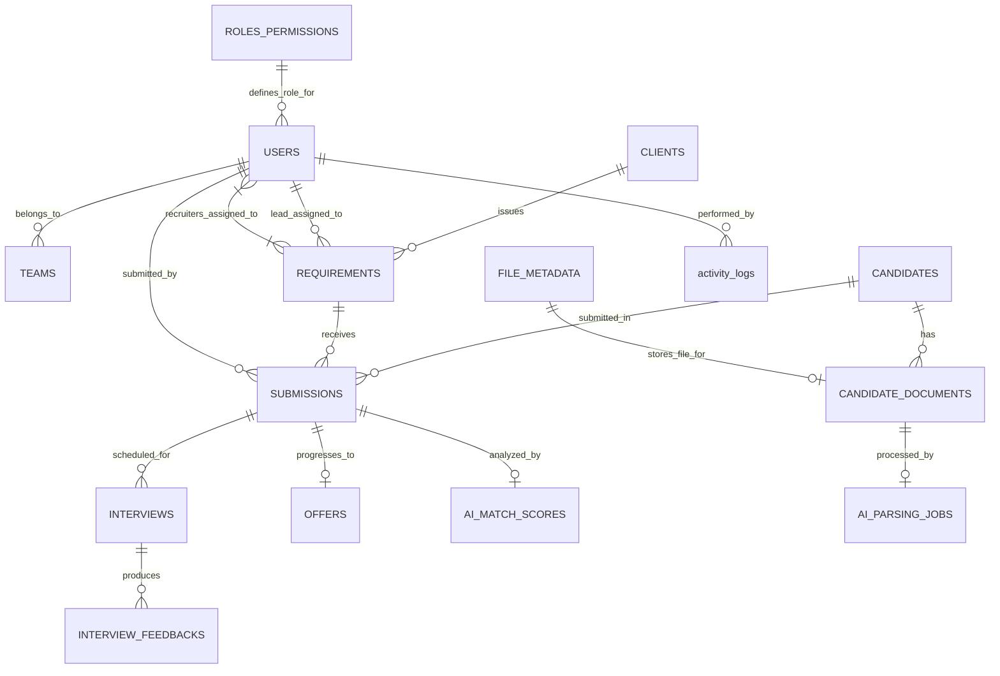
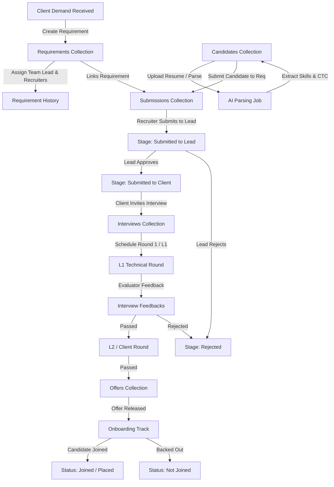
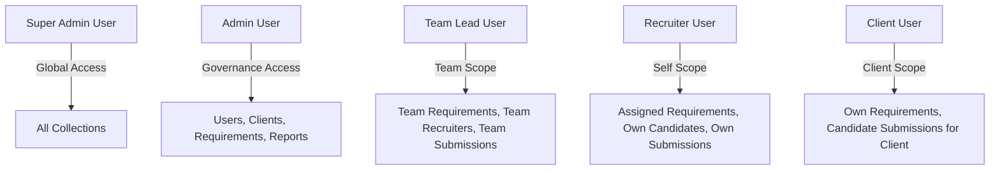

# MetaForge Recruiter Application V2 — Entity Relationships & Diagrams

**Document ID:** `docs/database/09B_Entity_Relationships.md`  
**Application:** MetaForge Recruiter Application (Version 2)  
**Target Stack:** NestJS + Mongoose (v8+) + MongoDB (v7+)  

---

## 1. High-Level Entity Relationship Diagram (ERD)

---

## 2. Recruitment Lifecycle Data Model

---

## 3. RBAC & Data Ownership Hierarchy

---

## 4. Key Reference Mappings Matrix

The following table summarizes foreign key references, cardinality, and cascade strategies:

| Source Collection | Target Collection | Field Name | Cardinality | Cascade / Constraint Strategy |
|---|---|---|---|---|
| `users` | `teams` | `teamId` | Many-to-One | Restrict Delete (Cannot delete team with active users) |
| `requirements` | `clients` | `clientId` | Many-to-One | Restrict Delete (Cannot delete client with active requirements) |
| `requirements` | `users` | `assignedLeadId` | Many-to-One | Set Null on User Deactivation |
| `requirements` | `users` | `assignedRecruiterIds` | Many-to-Many | Pull array element on Recruiter Deassignment |
| `submissions` | `candidates` | `candidateId` | Many-to-One | Restrict Delete (Preserve candidate history) |
| `submissions` | `requirements` | `requirementId` | Many-to-One | Restrict Delete (Preserve requirement pipeline) |
| `submissions` | `users` | `recruiterId` | Many-to-One | Preserve ID for Recruiter Performance Audit |
| `interviews` | `submissions` | `submissionId` | Many-to-One | Cascade Delete optional / Soft-cancel interview |
| `offers` | `submissions` | `submissionId` | One-to-One | Unique index constraint on `submissionId` |
| `candidate_documents` | `file_metadata` | `fileId` | One-to-One | Sync delete on document removal |
| `ai_match_scores` | `submissions` | `submissionId` | One-to-One | Auto-recalculate on candidate resume update |
