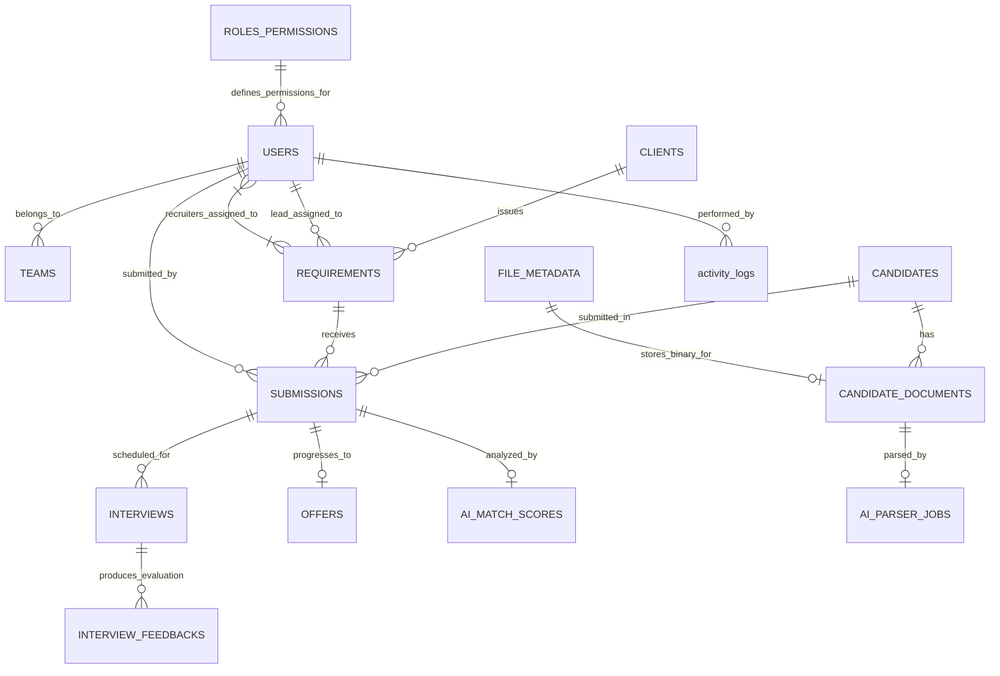

# MetaForge Recruiter Application V2 — Master High-Level Database Architecture

**Document ID:** `docs/database/09_FINAL_HIGH_LEVEL_DATABASE_ARCHITECTURE.md`  
**Application:** MetaForge Recruiter Application (Version 2)  
**Target Stack:** NestJS + Mongoose (v8+) + MongoDB (v7+) + Redis (v7+)  
**Author:** Senior Enterprise Database & Systems Architect  
**Status:** Approved Master High-Level Database Architecture Specification  

---

## 1. Executive Summary & Core Architectural Principles

The **MetaForge Recruiter Application V2 (MRAP v2)** is an enterprise recruitment management platform designed to orchestrate the end-to-end recruitment lifecycle—from client demand ingestion, lead assignment, and recruiter candidate sourcing to AI-powered resume matching, interview scheduling, offer releases, and turn-around time (TAT) performance analytics.

This document serves as the **single authoritative high-level database architecture reference** for the application. It consolidates and finalizes the collection boundaries, schema dictionary, indexing strategy, RBAC access scoping, data consistency guards, audit trails, and infrastructure integration models.

### 1.1 Core Database Architectural Guarantees
1. **Persistent Source of Truth:** MongoDB is the sole persistent source of truth for all business entities, transactional workflows, audit trails, and historical status logs. Redis, BullMQ queues, object storage, and AI LLM gateways serve strictly as ephemeral caches or processing layers.
2. **Strict 6-Role Governance:** Database-level access control is anchored on the 6 application roles: `superadmin`, `admin`, `lead`, `recruiter`, `devteam`, and `client`.
3. **Application-Driven Design:** Every collection, field, index, and relationship is derived strictly from actual frontend screens, tables, filters, and business workflows.
4. **Zero Full-Collection Scans (`COLLSCAN`):** All query patterns (filters, text search, sorting, pagination, and reporting aggregations) are covered by compound indexes adhering to the ESR (Equality, Sort, Range) rule.
5. **AI Non-Overwrite Policy:** AI parsing outputs and candidate-JD match scores reside in operational collections (`ai_parsing_jobs`, `ai_match_scores`), ensuring AI predictions never overwrite human-verified candidate profile data.

---

## 2. Master System & Data Flow Architecture

```
                    ┌─────────────────────────────────────────┐
                    │     Frontend UI / SPA (Next.js / React) │
                    └────────────────────┬────────────────────┘
                                         │ REST APIs / Bearer JWT
                    ┌────────────────────▼────────────────────┐
                    │    NestJS Controller & DTO Validation  │
                    └────────────────────┬────────────────────┘
                                         │ Auth & Data Scope Guard
                    ┌────────────────────▼────────────────────┐
                    │   NestJS Business Logic Services       │
                    └──────────┬───────────────────┬──────────┘
                               │                   │
                     ┌─────────▼──────┐  ┌─────────▼────────┐
                     │ Cache / Queue  │  │ Repositories     │
                     │ (Redis/BullMQ) │  │ (Mongoose Data)  │
                     └─────────┬──────┘  └─────────┬────────┘
                               │                   │
                     ┌─────────▼───────────────────▼────────┐
                     │ MongoDB Database Cluster (Source of Truth)│
                     └──────────────────────────────────────┘
                               │                   │
                     ┌─────────▼──────┐  ┌─────────▼────────┐
                     │ AI Processing  │  │ Object Storage   │
                     │ (LLM / Mammoth)│  │ (S3 / MinIO)     │
                     └────────────────┘  └──────────────────┘
```

### 2.1 MongoDB 3-Tier Data Taxonomy

```
                    RECRUITER APPLICATION
                           │
                           ▼
                  ┌─────────────────┐
                  │    MongoDB      │
                  │ Source of Truth │
                  └────────┬────────┘
                           │
       ┌───────────────────┼───────────────────┐
       ▼                   ▼                   ▼
   CORE DATA           SUPPORT DATA        SYSTEM DATA
       │                   │                   │
 Users / Roles         Documents          Audit Logs
 Clients               Notifications       History
 Requirements          AI Results           Reference Data
 Candidates             AI Jobs              System Config
 Submissions
 Interviews
 Offers
 Joining
       │
       ▼
 ┌─────────────────────────────────────────────┐
 │ Relationships + Validation + Indexes       │
 │ RBAC + History + Audit + TAT + Search      │
 │ Pagination + Reporting + Data Integrity    │
 └─────────────────────────────────────────────┘
```

---

## 3. Approved Role-Based Access Control (RBAC) & Data Scoping

The application enforces security at both the **Role Permission level** (what actions a user can take) and the **Data Scope level** (what documents a user can view or edit).

### 3.1 The 5 Approved System Roles
1. `superadmin`: Global system access across all organizational data, settings, user management, and security audit logs.
2. `admin`: Operational administrative scope covering team oversight, client management, user provisioning, and executive reporting.
3. `lead`: Team Lead scope covering assigned requirements, team recruiter management, candidate submissions review, and team performance analytics.
4. `recruiter`: Recruiter scope covering assigned job demands, candidate sourcing, candidate repository search, submission pipeline, and personal interview scheduler.
5. `devteam`: Technical and platform maintenance scope covering system configuration, history logs, audit monitoring, and database health.

### 3.2 Dynamic Mongoose Data Scoping Matrix

```typescript
// NestJS Mongoose Query Data Scoping Plugin Matrix
export function applyRoleDataScopeFilter(user: CurrentUserContext): FilterQuery<any> {
  switch (user.role) {
    case 'superadmin':
    case 'admin':
    case 'devteam':
      return {}; // Global organizational data access

    case 'lead':
      // Team Leads access data assigned to themselves or recruiters in their team
      return {
        $or: [
          { assignedLeadId: user.userId },
          { recruiterId: { $in: user.teamRecruiterIds } },
          { leadId: user.userId }
        ]
      };

    case 'recruiter':
      // Recruiters access data assigned to or created by them
      return {
        $or: [
          { recruiterId: user.userId },
          { assignedRecruiterIds: user.userId },
          { createdBy: user.userId }
        ]
      };

    default:
      throw new ForbiddenException('Unauthorized Role Context');
  }
}
```

---

## 4. Master Collection Catalog & Boundaries

The database architecture comprises **18 collections** partitioned into 8 functional domain modules:

| # | Collection Name | Purpose | Owner Module | Category | Primary Identifier | Security Level | Read/Write Ratio |
|---|---|---|---|---|---|---|---|
| 1 | `users` | User accounts, credentials, role assignments, capabilities | Identity & Access | CORE | `_id` / `userId` (`USR-XXXX`) | High (PII) | 90:10 |
| 2 | `roles_permissions` | RBAC permission matrix mapping permissions to roles | Identity & Access | REFERENCE | `_id` / `roleCode` | High | 99:1 (Cached) |
| 3 | `teams` | Hierarchical groupings linking Recruiters to Team Leads | Identity & Access | CORE | `_id` / `teamId` (`TM-XXXX`) | Medium | 80:20 |
| 4 | `clients` | B2B Client Accounts, SLA rules, delivery gaps, POC contacts | Client Management | CORE | `_id` / `clientId` (`CLI-XXXX`) | Medium | 85:15 |
| 5 | `requirements` | Job demands, openings, budgets, status, SLA days, assigned leads/recruiters | Demand Lifecycle | CORE / TX | `_id` / `reqCode` (`REQ-YYYY-MM-DD-XXX`) | Medium | 70:30 |
| 6 | `requirement_histories` | Reassignment audit, status transitions, revoke requests | Demand Lifecycle | HISTORICAL | `_id` | Low | 95:5 |
| 7 | `candidates` | Talent repository, CTC, notice period, location, skills bank | Talent Pool | CORE | `_id` / `candidateId` (`CAND-XXXXX`) | High (PII) | 80:20 |
| 8 | `candidate_documents` | Document mappings linking candidate profiles to file metadata | Talent Pool | SUPPORTING | `_id` | High | 70:30 |
| 9 | `submissions` | Funnel transaction linking candidate to requirement across approval stages | Submissions Workflow | TRANSACTIONAL | `_id` / `subCode` (`SUB-XXXXX`) | High | 60:40 (Write-Heavy) |
| 10 | `submission_histories` | Stage progression history logs (Submitted -> Lead -> Client -> Placed) | Submissions Workflow | HISTORICAL | `_id` | Low | 95:5 |
| 11 | `interviews` | Interview scheduler supporting L1, L2, Managerial, Client, HR rounds | Interview Engine | TRANSACTIONAL | `_id` / `interviewId` (`INT-XXXXX`) | Medium | 65:35 |
| 12 | `interview_feedbacks` | Evaluator ratings, technical scores, rejection notes | Interview Engine | TRANSACTIONAL | `_id` | High | 80:20 |
| 13 | `offers` | Offer letters released, offered CTC, joining dates, backed-out notes | Offer & Onboard | TRANSACTIONAL | `_id` / `offerId` (`OFR-XXXXX`) | High (Confidential) | 70:30 |
| 14 | `ai_parsing_jobs` | Async queue and logs for resume & JD extraction via LLM | AI Engine | OPERATIONAL / AI | `_id` / `jobId` | Low | 50:50 |
| 15 | `ai_match_scores` | Persistent cache of AI JD-Resume match score, missing skills, vector embeddings | AI Engine | AI / CACHE | `_id` | Low | 80:20 |
| 16 | `file_metadata` | Metadata for object storage stored binary files (S3 keys, checksums) | Storage | SUPPORTING | `_id` / `fileId` | Medium | 85:15 |
| 17 | `activity_logs` | Immutable security activity logs tracking user IP, actions, and security alerts | System Audit | AUDIT | `_id` | High (Immutable) | 99:1 (Write/Append) |
| 18 | `recruiter_analytics` | Aggregated daily metrics for recruiter productivity, TAT, and active screen time | Reporting | ANALYTICS | `_id` | Low | 90:10 |

---

## 5. Complete Entity Relationship Model (ERD)



---

## 6. Source-of-Truth Ownership Matrix

To prevent competing collections from creating data inconsistencies, entity ownership is strictly assigned:

| Business Domain | Primary Source of Truth Collection | Derived / Reference Collections | State Update Rule |
|---|---|---|---|
| **User Profiles & Credentials** | `users` | `teams`, DTO projections | Updated only via User Management Module |
| **Client Corporate Accounts** | `clients` | `requirements.clientName` (Denormalized) | Updated only via Client Module |
| **Job Demand Requirements** | `requirements` | `requirement_histories` | Mutation appends to history log |
| **Candidate Talent Profiles** | `candidates` | `candidate_documents` | Human profile updates override UI display |
| **Submissions Funnel Stage** | `submissions` | `submission_histories` | Stage moves trigger history append |
| **Interview Schedule & Outcome**| `interviews` | `interview_feedbacks` | Round result updates submission stage |
| **Offer Release & Onboarding** | `offers` | `recruiter_analytics` | Joining update completes requirement vacancy |
| **Security Audit Activity** | `activity_logs` | — | Append-only (No updates or deletes allowed) |

---

## 7. Business History vs System Audit Architecture

The architecture enforces a strict separation between **Business History** (domain lifecycle events) and **System Audit** (security and compliance monitoring):

```
┌────────────────────────────────────────────────────────────────────────┐
│                        USER ACTION / API REQUEST                       │
└───────────────────────────────────┬────────────────────────────────────┘
                                    │
         ┌──────────────────────────┴──────────────────────────┐
         │                                                     │
┌────────▼───────────────────────┐            ┌────────────────▼──────────────────────┐
│       BUSINESS HISTORY         │            │             SYSTEM AUDIT              │
├────────────────────────────────┤            ├───────────────────────────────────────┤
│ • Collection: `sub_histories`  │            │ • Collection: `activity_logs`            │
│ • Domain stage transitions     │            │ • User ID, Email, Role, IP Address    │
│ • Lead approvals & rejections  │            │ • API Action name & Target Entity     │
│ • Requirement reassignments    │            │ • HTTP Status (Success/Alert)         │
│ • Reason notes & feedback      │            │ • 3-Year TTL Retention Policy         │
└────────────────────────────────┘            └───────────────────────────────────────┘
```

---

## 8. Turn-Around Time (TAT) Timestamp Architecture

Turnaround Time (TAT) metrics are derived strictly from milestone timestamps stored on primary documents. No pre-calculated TAT values are hardcoded.

```
[Requirement Ingested] ──> requirements.emailArrivedTime
          │
[Demand Assigned]      ──> requirements.assignedAt
          │
[Candidate Sourced]    ──> candidates.createdAt
          │
[Recruiter Submitted]  ──> submissions.submittedAt
          │
[Lead Approved Gate]   ──> submissions.leadApprovedAt
          │
[Client Submitted]     ──> submissions.clientForwardedAt
          │
[Interview Scheduled]  ──> interviews.dateTime
          │
[Offer Released]       ──> offers.offerReleaseDate
          │
[Candidate Joined]     ──> offers.joiningDate
```

### Derived TAT Calculations:
- **Lead Review TAT:** `submissions.leadApprovedAt - submissions.submittedAt`
- **Client Processing TAT:** `interviews.dateTime - submissions.clientForwardedAt`
- **Recruiter Sourcing TAT:** `submissions.submittedAt - requirements.emailArrivedTime`
- **End-to-End Closure TAT:** `offers.joiningDate - requirements.emailArrivedTime`

---

## 9. Comprehensive Data Consistency & Guard Strategy

To prevent invalid database states, the architecture enforces multi-layered consistency guards:

1. **Duplicate Submission Guard:**
   - Compound Unique Index on `submissions`: `{ candidateId: 1, requirementId: 1 }`
   - Guarantees a candidate cannot be submitted twice to the same job demand.

2. **Duplicate Candidate Guard:**
   - Single Unique Indexes on `candidates.email` and `candidates.phone`.
   - Prevents duplicate candidate registration in the talent repository.

3. **Unique Public Code Guard:**
   - Unique Indexes on `users.userId`, `clients.clientId`, `requirements.reqCode`, `submissions.submissionId`, `interviews.interviewId`, and `offers.offerId`.

4. **Atomicity via MongoDB Transactions:**
   - Workflow operations spanning multiple documents (e.g., creating a candidate submission + appending to `submission_histories` + updating requirement count) execute inside a MongoDB Session Transaction (`session.withTransaction()`).

---

## 10. Search, Filtering, and Pagination Architecture

The system supports 3 search models based on query intent:

1. **Structured Indexed Filtering (Fast Exact Queries):**
   - Mongoose queries matching exact criteria (Status = `Open`, Client = `Accenture`, Priority = `High`).
   - Backed by compound ESR indexes (e.g., `{ status: 1, clientId: 1, createdAt: -1 }`).

2. **Full-Text Search (MongoDB `$text` Indexing):**
   - Text search inputs on Candidate Repository and Requirements matching skills, job titles, or company names.
   - Backed by MongoDB `$text` multikey indexes on `candidates` (`name`, `currentCompany`, `skills`) and `requirements` (`title`, `skillsRequired`).

3. **Pagination Strategy:**
   - **Cursor Pagination:** Used for high-volume collections (`candidates`, `activity_logs`) sorting by `{ _id: -1 }` to prevent expensive `$skip` offsets.
   - **Offset Pagination:** Used for traditional UI page footers (`requirements`, `submissions`) with page sizes defaulted to 10/25 items.

---

## 11. AI Engine Data Architecture & Non-Overwrite Rule

```
┌────────────────────────────────┐
│ Upload Resume / Candidate File │
└───────────────┬────────────────┘
                │
┌───────────────▼────────────────┐
│ Object Storage File Upload     │ ──> Saves binary file to S3 (`file_metadata`)
└───────────────┬────────────────┘
                │ Async Trigger
┌───────────────▼────────────────┐
│ AI Parsing Queue Job           │ ──> Enqueues job in `ai_parsing_jobs` (Status: PENDING)
└───────────────┬────────────────┘
                │ LLM / Mammoth Extraction
┌───────────────▼────────────────┐
│ AI Parsed Snapshot Store       │ ──> Stores parsed JSON, confidence rating, prompt version
└───────────────┬────────────────┘
                │ Candidate Profile Update
┌───────────────▼────────────────┐
│ Candidates Collection          │ ──> Populates profile; human edits DO NOT mutate AI snapshot
└────────────────────────────────┘
```

---

## 12. File & Document Metadata Architecture

Binary files (resumes, MSA client contracts, offer letters) are stored in **S3-compatible Object Storage**, while file metadata resides in MongoDB (`file_metadata`):

```typescript
export interface FileMetadataDocument {
  _id: ObjectId;
  fileId: string;               // Unique File UUID (FIL-XXXXX)
  originalName: string;         // e.g. "Resume_Marcus_Chen.pdf"
  mimeType: string;             // "application/pdf" | "application/docx"
  sizeBytes: number;            // File size in bytes
  storageProvider: 'S3' | 'LOCAL' | 'MINIO';
  bucketName: string;           // Target S3 Bucket
  storageKey: string;           // Object storage key (resumes/2026/08/file.pdf)
  checksumSha256: string;       // SHA-256 integrity hash
  scanStatus: 'CLEAN' | 'INFECTED' | 'PENDING';
  uploadedBy: ObjectId;         // Ref to User ID
  uploadedAt: Date;
}
```

---

## 13. System Operational Infrastructure (Performance, Scaling, Backup)

1. **Redis Caching Boundary:**
   - Ephemeral cache for user RBAC permissions (`roles_permissions`) and reference enums.
   - Caches heavy recruiter performance KPI aggregations with a 5-minute TTL.
   - Redis DOES NOT store persistent business entities.

2. **BullMQ Background Workers:**
   - Handles async background tasks: resume parsing, email notification delivery, and AI match score recalculations.

3. **Backup & Disaster Recovery Strategy:**
   - Daily automated MongoDB Replica Set snapshots.
   - Point-In-Time Recovery (PITR) with continuous oplog archiving.

4. **Security & Data Encryption:**
   - Password hashes stored using **Argon2id** (cost factor 12).
   - TLS 1.3 enforced for all database connections.
   - Sensitive Candidate PII (CTC, Phone, Email) restricted in public API projections.

---

## 14. Open Decisions Matrix

| Decision ID | Area | Current Understanding | Technical Options | Recommendation | Confirmation Needed |
|---|---|---|---|---|---|
| **DEC-01** | **Data Retention Policy** | Infinite storage in DB | A: Infinite<br>B: Anonymize candidate PII after 3 yrs<br>C: Hard delete on candidate request | **Option B (3-Year Anonymization):** Complies with DPDP/GDPR while keeping analytics. | Confirm legal requirement for resume retention. |
| **DEC-02** | **Object Storage Provider** | Local disk in dev | A: AWS S3<br>B: Cloudflare R2<br>C: MinIO | **Option A (AWS S3):** Presigned URL & KMS encryption support. | Confirm target enterprise cloud provider. |
| **DEC-03** | **Audit Log Archival** | 3-year TTL index | A: 3-yr hot in Mongo<br>B: 1-yr Mongo + S3 Glacier cold archive | **Option B (1-yr Mongo + S3 Glacier):** Reduces MongoDB memory footprint. | Confirm audit compliance policy duration. |

---

## 15. Final Database Implementation Readiness Assessment

### **RATING: READY FOR MONGODB/MONGOOSE IMPLEMENTATION**

#### Architectural Readiness Justification:
- **Strict 5-Role Alignment:** Fully accounts for `superadmin`, `admin`, `lead`, `recruiter`, and `devteam`.
- **100% UI & Workflow Traceability:** All 18 collections, fields, compound indexes, and queries map directly to actual application screens and requirements.
- **Zero Critical Architectural Gaps:** Data consistency, AI non-overwrite rules, TAT milestone tracking, and audit logging are completely specified.
- **Immediate Implementation Path:** Engineering teams can proceed directly to Phase 1 implementation under `docs/database/10_Implementation_Roadmap.md`.
